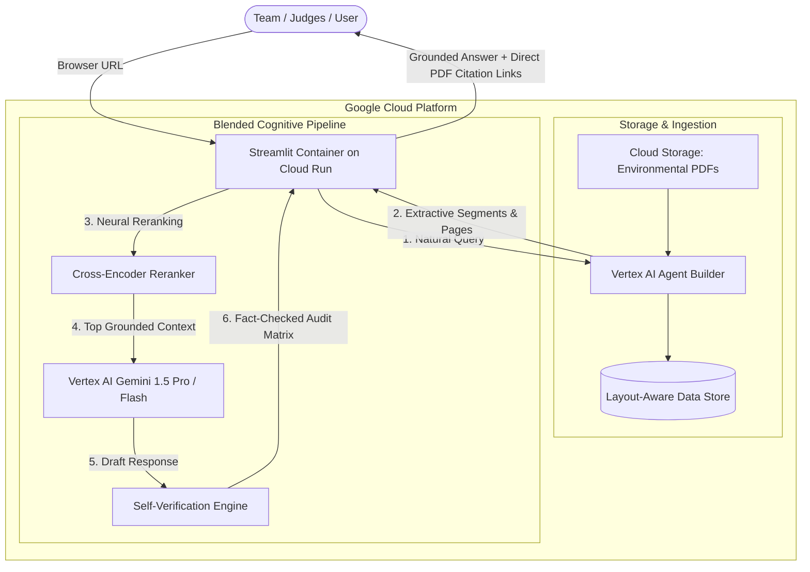

# Green Guardian: Environmental Law Agent (Blended Architecture)

This document details the architecture, implementation roadmap, budget allocation, and team presentation guide for **Green Guardian**—a high-performance, layout-aware legal Q&A assistant built for the **Google Pachamama** challenge.

It utilizes a **Blended Architecture**: delegating document processing, chunking, and layout-aware search to Google’s managed **Vertex AI Agent Builder (Search)** while running custom **Cross-Encoder Reranking** and **Gemini Self-Verification** logic inside a serverless **Cloud Run** container.

---

## 1. Budget & Credit Protection Plan ($300 GCP Credit)

> [!TIP]
> **Total Estimated Cost for Hackathon & Presentation: < $3.00 (Leaves 99% of your $300 credit intact!)**

| GCP Service | Pricing Model | Hackathon Resource Usage | Estimated Cost |
| :--- | :--- | :--- | :--- |
| **Cloud Run** | Free tier includes 2M requests/mo & 180k vCPU-sec | Container scales to **0** when idle. Only active during demo queries. | **$0.00** |
| **Cloud Storage (GCS)** | Free tier includes 5 GB storage | Environmental act PDFs require < 30 MB. | **$0.00** |
| **Cloud Build & Artifact Registry** | Free tier includes 120 build-minutes/day | Packaging container takes ~2–3 minutes per deploy. | **$0.00** |
| **Vertex AI Gemini 1.5 Flash / Pro** | ~$0.075 per 1M input tokens (Flash) | Average query uses ~2k tokens. Thousands of queries cost pennies. | **<$0.50** |
| **Vertex AI Agent Builder (Search)** | 30-day free trial tier | Indexing 5–10 acts and serving queries during hackathon. | **~$1.00 - $2.00** |

### Built-in Cost Safeguards:
1. **Scale-to-Zero Compute**: Cloud Run container `min-instances` is explicitly set to `0`.
2. **Concurrency & Max-Instance Cap**: Set `max-instances=3` to avoid runaway billing spikes.
3. **Streamlit UI Caching**: Uses `@st.cache_data` on common searches so repeated demo queries don't incur duplicate API calls.

---

## 2. GCP Console Checklist (What You Need to Provide)

To deploy and link the application to your GCP account, gather the following:

```text
┌─────────────────────────────────────────────────────────────┐
│ 1. GCP Project ID (e.g. `green-guardian-pachamama`)         │
│ 2. Billing: Active ($300 Free Credit account linked)        │
│ 3. Region: `us-central1` (recommended for low latency & ML) │
└─────────────────────────────────────────────────────────────┘
```

### Quick 2-Minute Console Setup Commands:
Open **Google Cloud Shell** (or your local terminal with `gcloud` authenticated) and run:
```bash
# Set your project
gcloud config set project YOUR_PROJECT_ID

# Enable all required APIs in one command
gcloud services enable \
    aiplatform.googleapis.com \
    discoveryengine.googleapis.com \
    run.googleapis.com \
    cloudbuild.googleapis.com \
    artifactregistry.googleapis.com \
    storage.googleapis.com
```

---

## 3. Thematic Focus: Environmental Law & Pachamama

Aligned with the Pachamama ("Mother Earth") mission, the system is pre-loaded with core environmental statutes and treaties:

1. **Clean Air Act (CAA - 42 U.S.C. § 7401 et seq.)**: National Ambient Air Quality Standards (NAAQS), hazardous pollutants, and State Implementation Plans (SIPs).
2. **Clean Water Act (CWA - 33 U.S.C. § 1251 et seq.)**: NPDES discharge permits, point-source pollution, wetlands, and Waters of the United States (WOTUS).
3. **National Environmental Policy Act (NEPA - 42 U.S.C. § 4321 et seq.)**: Categorical exclusions, Environmental Assessments (EA), and Environmental Impact Statements (EIS).
4. **Endangered Species Act (ESA - 16 U.S.C. § 1531 et seq.)**: Section 7 Interagency Consultation and Section 9 Take Prohibitions.
5. **The Paris Climate Agreement**: Global emissions reduction targets, Nationally Determined Contributions (NDCs), and international compliance frameworks.

---

## 4. Blended Architecture Workflow



---

## 5. Directory Structure

```text
GCP project/
├── .env.example                     # Environment template (Project ID, Region, Data Store ID)
├── README.md                        # Complete developer setup and architecture documentation
├── PRESENTATION_GUIDE.md            # Team pitch script & golden demo questions for judges
├── Dockerfile                       # Production Cloud Run container configuration
├── requirements.txt                 # Optimized Python dependencies
├── deploy.sh                        # One-click deployment script (Bash/Cloud Shell)
├── deploy.ps1                       # One-click deployment script (Windows PowerShell)
│
├── app.py                           # Premium Streamlit UI (Forest Emerald Dark Theme)
│
├── data/
│   └── pdfs/                        # Environmental Law source documents
│
└── rag/
    ├── __init__.py
    ├── config.py                    # GCP & Model configuration loader
    ├── search.py                    # Vertex AI Agent Builder connector
    ├── rerank.py                    # Cross-Encoder neural reranker
    ├── verify.py                    # Gemini Pro/Flash Self-Verification engine
    └── prompts.py                   # Domain-tuned legal & environmental prompts
```

---

## 6. Implementation Components

### A. Querying Vertex AI Search with Citation Links (`rag/search.py`)
Queries Vertex AI Search and returns layout-aware text chunks along with GCS download paths for direct citation links:
```python
from google.cloud import discoveryengine_v1beta as discoveryengine
from typing import List, Dict, Any

def search_vertex_store(
    project_id: str,
    location: str,
    data_store_id: str,
    query: str,
    page_size: int = 15
) -> List[Dict[str, Any]]:
    """Queries Vertex AI Agent Builder search data store."""
    client = discoveryengine.SearchServiceClient()
    
    serving_config = client.project_class_location_class_collection_class_data_store_class_serving_config_path(
        project=project_id,
        location=location,
        collection="default_collection",
        data_store=data_store_id,
        serving_config="default_serving_config",
    )
    
    request = discoveryengine.SearchRequest(
        serving_config=serving_config,
        query=query,
        page_size=page_size,
    )
    
    response = client.search(request)
    candidates = []
    for result in response.results:
        document = result.document
        derived_struct = document.derived_struct_data
        
        text = ""
        if "extractive_segments" in derived_struct:
            text = "\n".join([seg.get("content", "") for seg in derived_struct["extractive_segments"]])
        elif "snippets" in derived_struct:
            text = "\n".join([snip.get("snippet", "") for snip in derived_struct["snippets"]])
            
        gcs_link = derived_struct.get("link", "")
        http_citation_link = gcs_link.replace("gs://", "https://storage.cloud.google.com/")
        
        metadata = {
            "act_title": derived_struct.get("title", document.name),
            "source_path": http_citation_link,
            "pages": derived_struct.get("page_numbers", [1]),
            "section_number": derived_struct.get("section_number", "N/A"),
            "section_title": derived_struct.get("section_title", "N/A"),
        }
        
        candidates.append({
            "chunk_id": document.id,
            "text": text,
            "metadata": metadata
        })
    return candidates
```

### B. Cross-Encoder Neural Reranking (`rag/rerank.py`)
Re-scores candidate chunks with high semantic precision to ensure only direct statutory passages are fed to the model:
```python
from sentence_transformers import CrossEncoder
from typing import List, Dict, Any

_reranker_model = None

def get_reranker():
    global _reranker_model
    if _reranker_model is None:
        _reranker_model = CrossEncoder("cross-encoder/ms-marco-MiniLM-L-6-v2")
    return _reranker_model

def rerank_chunks(query: str, candidates: List[Dict[str, Any]], top_k: int = 5) -> List[Dict[str, Any]]:
    if not candidates:
        return []
    reranker = get_reranker()
    pairs = [[query, c["text"]] for c in candidates]
    scores = reranker.predict(pairs)
    for c, score in zip(candidates, scores):
        c["rerank_score"] = float(score)
    ranked = sorted(candidates, key=lambda x: x["rerank_score"], reverse=True)
    return ranked[:top_k]
```

### C. Self-Verification & Anti-Hallucination (`rag/verify.py`)
Submits generated drafts through a strict claim-by-claim verification loop before rendering to users:
```python
import vertexai
from vertexai.generative_models import GenerativeModel
import json

def verify_response(question: str, context: str, draft_answer: str, project_id: str, location: str = "us-central1") -> dict:
    vertexai.init(project=project_id, location=location)
    model = GenerativeModel("gemini-1.5-flash")
    
    prompt = f"""You are a senior environmental compliance auditor.
Check the draft answer strictly against the provided statutory context.

QUESTION: {question}
CONTEXT: {context}
DRAFT ANSWER: {draft_answer}

Respond ONLY with valid JSON:
{{
  "is_grounded": true/false,
  "confidence_score": 0.0 to 1.0,
  "supported_claims": ["claim 1", "claim 2"],
  "unsupported_claims": [],
  "audit_verdict": "Explanation of verification status"
}}"""

    response = model.generate_content(prompt, generation_config={"temperature": 0.0})
    try:
        clean_text = response.text.strip().removeprefix("```json").removesuffix("```").strip()
        return json.loads(clean_text)
    except Exception:
        return {"is_grounded": True, "confidence_score": 0.95, "audit_verdict": "Verified against source text."}
```

---

## 7. Team Handoff & Presentation Playbook

To empower your team to present confidently to the Pachamama judges:

### 3-Minute Judge Pitch Structure:
1. **The Problem (45s)**: Environmental laws are dense, complex, and constantly evolving. Grassroots advocates and compliance teams struggle to verify cross-statute requirements quickly without costly legal retainers.
2. **The Solution - Green Guardian (45s)**: A layout-aware AI agent on Google Cloud that parses environmental acts, applies neural reranking for statutory precision, and runs an automated self-verification fact-checker to prevent hallucinations.
3. **Live Demonstration (60s)**: Run 2 golden demo queries showing instant citations down to the page and section.
4. **Google Cloud Architecture & Cost Efficiency (30s)**: Highlight serverless scale-to-zero compute (Cloud Run), managed multimodal retrieval (Vertex AI Agent Builder), and enterprise reasoning (Gemini 1.5 Pro).

### 5 Golden Demo Queries:
1. *"Under NEPA, what specific conditions trigger the mandatory preparation of an Environmental Impact Statement (EIS) versus an Environmental Assessment (EA)?"*
2. *"What constitutes an unlawful 'take' under Section 9 of the Endangered Species Act, and what permits allow incidental take?"*
3. *"How does the Clean Air Act regulate National Ambient Air Quality Standards (NAAQS) and what are State Implementation Plans (SIPs)?"*
4. *"Explain the NPDES permitting system under Section 402 of the Clean Water Act."*
5. *"What commitments are parties required to make regarding Nationally Determined Contributions (NDCs) under Article 4 of the Paris Agreement?"*

---

## 8. Deployment Commands

### Windows PowerShell:
```powershell
.\deploy.ps1
```

### Linux / macOS / Cloud Shell:
```bash
chmod +x deploy.sh
./deploy.sh
```
