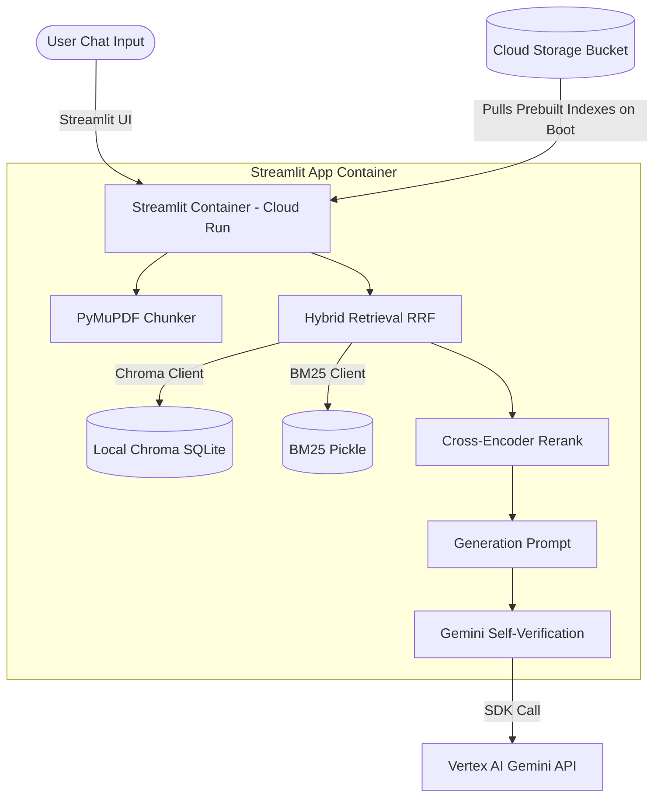
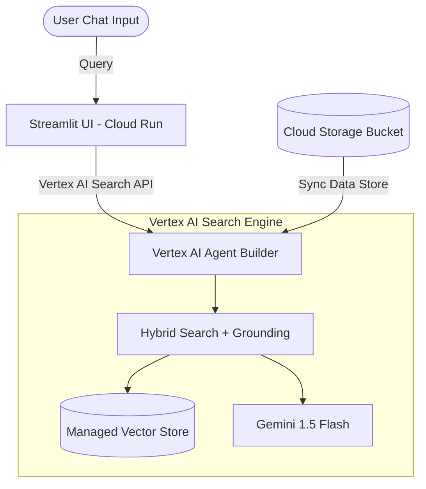

# US Constitution & Law RAG Agent on Google Cloud Platform (GCP)

This plan outlines the architecture, step-by-step implementation, and deployment of a legal QA RAG (Retrieval-Augmented Generation) agent focused on the **American Constitution and other key federal laws** on Google Cloud Platform. 

It is designed for the **Google Pachamama** event, leveraging GCP's serverless and GenAI features. Since you are new to GCP, this guide starts with setting up your GCP environment and offers two paths: a custom pipeline migration and a fully managed Vertex AI Agent Builder.

---

## GCP Services Used

Before we begin, here is a glossary of the GCP services we will use and why we use them:

| GCP Service | What it is | Why we use it |
| :--- | :--- | :--- |
| **Google Cloud Project** | The logical container for all your resources, billing, and permissions. | Everything in GCP must live inside a project. |
| **Google Cloud Storage (GCS)** | A highly durable and scalable object storage service (like an online folder system). | To store raw PDFs (Constitution, Bill of Rights, etc.) and prebuilt index files (`storage/`). |
| **Cloud Run** | A serverless compute platform that runs containers (Docker images) automatically. | Hosts the Streamlit frontend. It scales down to zero when idle, meaning **you only pay when the app is actively being used**—perfect for events and hackathons. |
| **Vertex AI Gemini API** | Google's managed enterprise generative AI platform. | Provides access to Gemini models (`gemini-1.5-flash` or `gemini-1.5-pro`) with built-in safety, reliability, and low latency. |
| **Artifact Registry** | A secure repository for managing container images (Docker). | Stores the packaged Streamlit application image before deploying it to Cloud Run. |
| **Cloud Build** | A serverless CI/CD service that builds and packages code. | Compiles the Docker container for the Streamlit app on Google's cloud servers. |
| **Vertex AI Agent Builder** | A low-code/no-code tool to create RAG search apps. | (Option B) Handles chunking, embedding, index hosting, and grounding automatically. |

---

## Architectural Options

We recommend two architectural paths depending on how much control you want over the retrieval internals:

### Option A: Custom RAG Pipeline (Recommended for migrating `NyayaSpashti`)
This path keeps your current advanced retrieval architecture intact (Custom Chunking + Hybrid Chroma/BM25 + RRF + Cross-Encoder Reranker + Self-Verification) but hosts it on GCP.



### Option B: Fully Managed RAG with Vertex AI Agent Builder
This path delegates chunking, embedding, indexing, and vector search to GCP's enterprise RAG platform. You only need to write a simple Streamlit frontend that calls the Agent Builder API.



---

## Step 1: Initial GCP Project Setup

To use GCP, you must configure your account and enable the required APIs.

1. **Create a GCP Project**:
   - Go to the [Google Cloud Console](https://console.cloud.google.com/).
   - Click the project dropdown and click **New Project**. Name it `law-rag-agent` (or similar).
2. **Set up Billing**:
   - Ensure a billing account is linked to your project. (New users usually get $300 in free credits, and many services have generous free tiers).
3. **Install Google Cloud SDK (Optional for local CLI deployment)**:
   - Install the `gcloud` CLI tool on your local machine to deploy from your terminal. Or, you can use the **Cloud Shell** directly inside the Google Cloud Console web browser.
4. **Enable APIs**:
   - Navigate to **APIs & Services > Library** and search for and enable:
     - Vertex AI API (`aiplatform.googleapis.com`)
     - Cloud Run API (`run.googleapis.com`)
     - Cloud Build API (`cloudbuild.googleapis.com`)
     - Artifact Registry API (`artifactregistry.googleapis.com`)
     - Cloud Storage API (`storage.googleapis.com`)

---

## Step 2: Preparing the Legal PDFs

For the American Constitution and legal system, gather the following files and place them in your `data/pdfs/` folder:
- **United States Constitution**: The foundational document.
- **Bill of Rights**: First 10 Amendments.
- **Subsequent Amendments**: Amendments 11-27.
- **Federalist Papers**: (Optional, but excellent context for constitutional interpretation).
- **Declaration of Independence**: Optional historical context.

---

## Step 3: Option A Implementation (Custom Python RAG)

If you proceed with **Option A** (migrating the existing codebase):

### 1. Modifying the PDF Parser for US Law (`rag/ingest.py`)
US Law documents use different formatting headers than Indian Acts. We must adapt the regex patterns in `rag/ingest.py`:
- **Article Headers**: e.g., "Article. I.", "ARTICLE II."
- **Section Headers**: e.g., "Section. 1.", "SECTION 2."
- **Amendments**: e.g., "Amendment I", "AMENDMENT XIV"

```python
# Modified regex patterns for US legal documents
ARTICLE_RE = re.compile(r"^\s*(?:Article|ARTICLE)\.?\s+([IVXLC\d]+)\b(.*)$", re.IGNORECASE)
SECTION_RE = re.compile(r"^\s*(?:Section|SECTION)\.?\s+(\d+)\b\.?\s*(.*)$", re.IGNORECASE)
AMENDMENT_RE = re.compile(r"^\s*(?:Amendment|AMENDMENT)\.?\s+([IVXLC\d]+)\b(.*)$", re.IGNORECASE)
```

### 2. Updating Gemini API client to Vertex AI SDK
In `app.py` and `rag/verify.py`, update from the developer Gemini SDK (`google-generativeai`) to the enterprise GCP SDK (`google-cloud-aiplatform` or Vertex AI native `google-genai` package):

*Before (Developer SDK):*
```python
import google.generativeai as genai
genai.configure(api_key=api_key)
model = genai.GenerativeModel("gemini-2.5-flash-lite")
response = model.generate_content(prompt)
```

*After (Vertex AI SDK):*
```python
from google.cloud import aiplatform
import vertexai
from vertexai.generative_models import GenerativeModel

# Initialize Vertex AI with project and location (e.g., us-central1)
vertexai.init(project="YOUR_PROJECT_ID", location="us-central1")
model = GenerativeModel("gemini-1.5-flash") # Or gemini-1.5-pro
response = model.generate_content(prompt)
```
> [!NOTE]
> When running inside Cloud Run, GCP automatically handles authentication using the default service account, so you **do not** need to store or manage API keys in `.env` files or secrets!

### 3. Storing and Fetching Chunks from Google Cloud Storage
Because Cloud Run is serverless and stateless, its disk storage is ephemeral. Any data saved to the local file system will be lost when the container scales down.
To make it work, build your index locally, upload the `storage/` folder to a Cloud Storage bucket, and modify the app startup in `app.py` to download the index files:

```python
from google.cloud import storage
import os

def download_indexes_from_gcs(bucket_name: str, local_dir: str = "storage"):
    """Downloads index files from Google Cloud Storage to local directory on container boot."""
    if os.path.exists(local_dir) and len(os.listdir(local_dir)) > 0:
        return # Already downloaded or present
    
    storage_client = storage.Client()
    bucket = storage_client.bucket(bucket_name)
    blobs = bucket.list_blobs(prefix="storage/")
    
    for blob in blobs:
        if blob.name.endswith("/"): # Skip directory placeholders
            continue
        # Create local parent folders if needed
        local_file_path = os.path.join(".", blob.name)
        os.makedirs(os.path.dirname(local_file_path), exist_ok=True)
        blob.download_to_filename(local_file_path)
```

---

## Step 4: Containerizing and Deploying to Cloud Run

To deploy Streamlit to GCP, we package it inside a Docker container.

### 1. Create a `Dockerfile` in the project root:
```dockerfile
# Use a lightweight python image
FROM python:3.11-slim

# Set working directory
WORKDIR /app

# Install system dependencies
RUN apt-get update && apt-get install -y \
    build-essential \
    curl \
    software-properties-common \
    git \
    && rm -rf /var/lib/apt/lists/*

# Copy requirements and install
COPY requirements.txt .
RUN pip install --no-cache-dir -r requirements.txt

# Copy application files
COPY app.py .
COPY rag/ ./rag/

# Streamlit config environment variables
ENV STREAMLIT_SERVER_PORT=8080
ENV STREAMLIT_SERVER_ADDRESS=0.0.0.0

# Expose port 8080 (Cloud Run default)
EXPOSE 8080

# Command to run Streamlit
ENTRYPOINT ["streamlit", "run", "app.py"]
```

### 2. Build and Deploy Command (Run from Cloud Shell or CLI):
Create an Artifact Registry repository to hold your Docker image:
```bash
gcloud artifacts repositories create law-rag-repo \
    --repository-format=docker \
    --location=us-central1 \
    --description="Docker repository for Law RAG Agent"
```

Use Cloud Build to build the container, push it to Artifact Registry, and deploy to Cloud Run in one go:
```bash
# Build image using Cloud Build
gcloud builds submit --tag us-central1-docker.pkg.dev/YOUR_PROJECT_ID/law-rag-repo/streamlit-app:latest

# Deploy to Cloud Run
gcloud run deploy law-rag-agent \
    --image us-central1-docker.pkg.dev/YOUR_PROJECT_ID/law-rag-repo/streamlit-app:latest \
    --platform managed \
    --region us-central1 \
    --allow-unauthenticated \
    --set-env-vars="GCS_BUCKET_NAME=your-gcs-bucket-name"
```

---

## Step 5: Option B Implementation (Vertex AI Agent Builder)

If you prefer the **Option B** (low-code/no-code managed RAG):

1. **Upload PDFs to Cloud Storage**:
   - Create a bucket: `gs://your-us-laws-pdfs`
   - Upload the American Constitution and law PDFs.
2. **Create Data Store**:
   - Go to **Vertex AI > Agent Builder > Data Stores**.
   - Click **Create Data Store**.
   - Select **Cloud Storage** as the source, point to your bucket, and choose **Unstructured documents**.
   - Choose **Layout Parser** (which provides high-quality structured chunks).
3. **Create Search App**:
   - Go to **Vertex AI > Agent Builder > Apps**.
   - Click **Create App** and choose **Search**.
   - Link the Data Store you created.
4. **Integration Code (Streamlit)**:
   - Your Streamlit code becomes incredibly simple, querying the Search engine:
   ```python
   from google.cloud import discoveryengine_v1beta as discoveryengine

   def query_agent_builder(project_id: str, location: str, data_store_id: str, query: str):
       client = discoveryengine.SearchServiceClient()
       serving_config = f"projects/{project_id}/locations/{location}/collections/default_collection/dataStores/{data_store_id}/servingConfigs/default_serving_config"
       
       request = discoveryengine.SearchRequest(
           serving_config=serving_config,
           query=query,
           page_size=5
       )
       
       response = client.search(request)
       return response.results
   ```

---

## Verification & Testing Plan

### Automated Verification
- Write a short Python test script to verify connection to Vertex AI Gemini:
  `python -c "import vertexai; vertexai.init(); from vertexai.generative_models import GenerativeModel; print(GenerativeModel('gemini-1.5-flash').generate_content('Hello').text)"`

### Manual Verification
1. **Local Test**: Run the Streamlit app locally with your GCP credentials exported in your terminal.
2. **Deploy to Dev**: Execute the `gcloud run deploy` command and verify the public URL generated by Cloud Run.
3. **Fact-Checking**: Query the agent about US constitutional amendments (e.g., "What are the rules of succession according to the 25th Amendment?") and confirm it extracts the exact section and page number correctly.

---

## Open Questions & Review

> [!IMPORTANT]
> **1. Which Architecture fits your goal best?** 
> * **Option A (Custom Python)** gives you maximum control over embedding models, BM25 matching, custom reranking, and self-verification logic.
> * **Option B (Vertex AI Agent Builder)** is a fast, robust, and managed production-grade service that handles chunking/embedding/vector storage for you.
>
> **2. Do you have a GCP billing account or Google Cloud credits ready?**
> Vertex AI APIs and Cloud Run require an active billing profile, although they fit comfortably within the GCP Free Tier limit.
